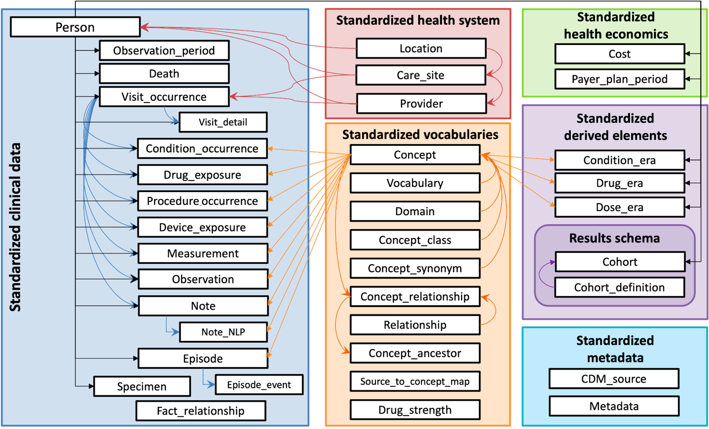
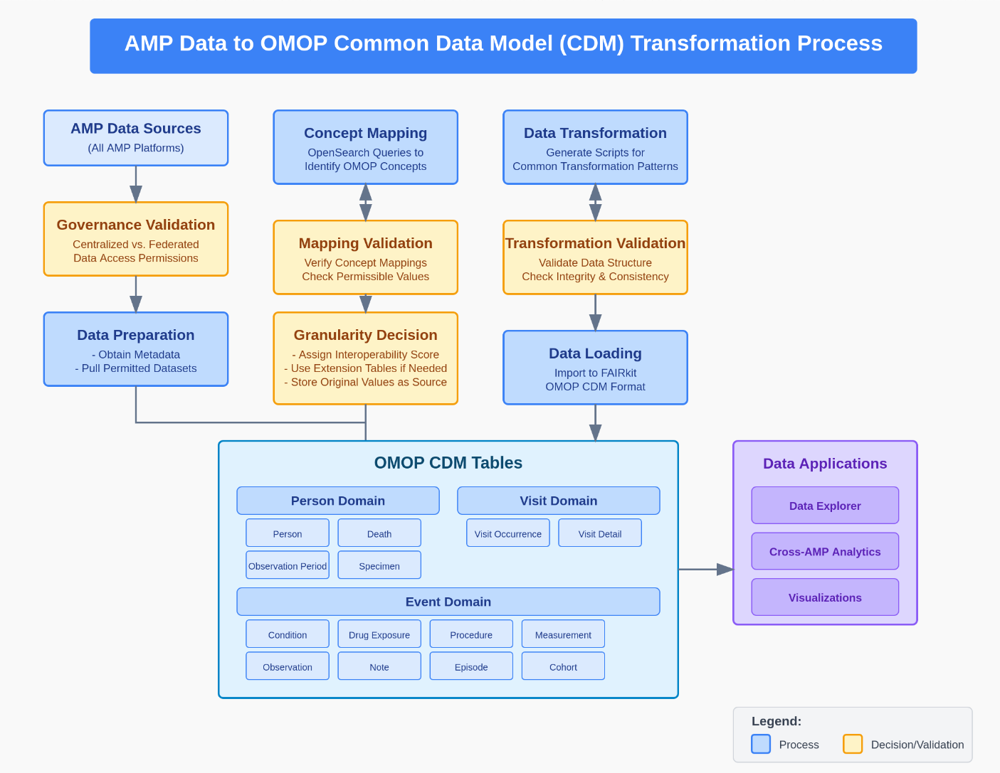

# The SysBio Common Data Model

## Introduction

The SysBio Common Data Model (SysBio CDM) will provide a standardized framework that defines how data entities, attributes, and relationships are organized across multiple datasets. The SysBio CDM will support consistency, interoperability, and easier integration of data from different sources.

We will base the core element of the SysBio CDM on the <a href="https://www.ohdsi.org/data-standardization/Observational">Medical Outcomes Partnership (OMOP) CDM</a> and extend it by modeling relationships from the ‘Person’ to specimens, assays, files, and genes, and the upstream AMP project Dataset relationship. Much of this work will be influenced by foundational efforts from the <a href="https://cde.nlm.nih.gov/home">NLM CDE Catalog</a>, <a href="https://www.nature.com/articles/npre.2009.3482.1">Ontology-Based eXtensible data model (OBX)</a>, and the <a href="https://support.researchallofus.org/hc/en-us/articles/4619151535508-Data-Types-and-Organization">All of Us data organizatiob</a>

The intent is for the SysBio CDM to include the required properties and variables for individual AMPs, facilitating data return. This will allow for queries through SysBio FAIRplex using the harmonized variables and the individual AMPs using AMP specific variables. See the <a href="https://github.com/SysBio-FAIRplex/FAIRgit/blob/main/science-harmonization/documentation/DataHarmonization.md">data harmonization methods and outputs</a>

**This work has been initiated through a survey of a subset of data dictionaries and data elements collected from AMP Projects. These will be expanded on as additional elements are incorporated.**

# Introduction to OMOP Standards

OMOP is a relational database where each table houses a specific category of data. Below is an overview of the key OMOP tables used in FAIRplex (***Figure 1 OMOP CDM Tables***) and examples of FAIRplex variables mapped to each domain.

The Observational Medical Outcomes Partnership (OMOP) Common Data Model (CDM) is a standardized data model designed to facilitate the analysis of observational healthcare data. It achieves this by providing a structured framework for organizing disparate data sources into a common format, enabling researchers to efficiently and accurately query and analyze data across multiple studies and institutions.

As a note, please refer to the Data Output documentation for details on file formats, structures and content of data in this common data model.

**Key Features**

-   **Standardized Vocabularies:** OMOP CDM utilizes standardized vocabularies and terminologies to ensure consistency and comparability of data across different sources.

-   **Harmonized Relational Structure:** The model employs a relational database structure, where data is organized into interlinked tables, each representing a specific domain of healthcare information

-   **Person-Centric Approach:** OMOP CDM adopts a person-centric approach, with the "Person" table serving as the central table connecting various aspects of patient data and mapping to omics table (additional table for FAIRplex needs )

-   **Flexibility and Extensibility:** While providing a standardized structure, the model allows for flexibility and is extendible across AMPs to accommodate diverse data types and research needs.

***Figure 1** - Reference OMOP Standards from OHDSI*

## Clinical Data

We will organize clinical data within the SysBio FAIRplex platform according to the OMOP CDM, leveraging its standardized relational structure. This model uses various interconnected tables, such as the “Person” table as the central point, to represent different domains of healthcare information. As illustrated in **Figure 2 (Transformation Engine for OMOP Standardization)**, the incoming clinical data undergoes a transformation process to ensure it conforms to the OMOP standards. This engine facilitates the mapping of raw clinical data into the appropriate OMOP CDM tables, ensuring consistent vocabularies, harmonized structures, and a person-centric approach. This transformation enables the data to be interoperable and analyzable across different studies and sources within the FAIRplex platform.

***Figure 2** -Transformation Engine for OMOP Standardization*

## Genetics and Omics

We will initially focus on modeling genetics and transcriptomics and proteomics data. These data types present unique storage and management challenges due to their large volume and complex structure. In the SysBio FAIRplex platform these data will be stored in HDF5 (Hierarchical Data Format version 5) format. HDF5 is a high-performance data storage format designed for storing and organizing large amounts of numerical data allows for the efficient retrieval of complex datasets.

The SysBio CDM will link to the HDF5 file path, establishing the connection between the data and the clinical metadata within the OMOP CDM. The location of the HDF5 files containing the omics data will be referenced within the "omics_table." This means that the data model will not contain the omics data itself, but rather a pointer or file path to where the data is stored in the HDF5 files. This approach allows for efficient storage of the large omics datasets while maintaining a connection to the related clinical and other data within the OMOP CDM. The "omics_table" will contain metadata and the file path that enables linking to the detailed omics data in the HDF5 files

# SysBio CDM Entities

## FAIRplex Clinical Variable Mappings by OMOP Tables

### PERSON

**Purpose:** Store demographic and administrative information.

**Representative AMP Variables:**

-   **Age Fields:** Age, age, age_at_baseline \| age1, age_at_diagnosis, ageDeath, AgeCorrectedStandardScore, ageUnits

-   **Gender & Race:** gender, Sex, Race, race, race2

-   **Education & Family:** education, code_education_12years_complete, FathersEducation, MothersEducation

-   **Administrative: a**dmin, individualID, participant_id

**Mapping Table – PERSON**

| AMP Data Element(s)-(Direct from AMPs) | Description | Mapping Details |
|------------------------|------------------------|------------------------|
| **age** | Patient age at time of recording | Used to derive birth year or age groups |
| **age_at_diagnosis** | Patient’s age at time of diagnosis | Used to derive passage of time from diagnosis to point of data recording |
| **age_at_baseline** | Patient’s age when joining a study |  |
| **age_at_death** |  |  |
| **gender, gender2** | Patient gender | Maps to standardized gender concept |
| **Race, race, race2** | Patient race | Mapped to OMOP race concepts |
| **sex** | Patient sex |  |
| **education, code_education_12years_complete, FathersEducation, MothersEducation** | Education and family background | Custom mapping to PERSON extended attributes |
| **individualID, participant_id** | Unique identifiers | Stored as additional attributes in PERSON |

### VISIT_OCCURRENCE

**Purpose:** Capture encounters and healthcare visits.

**Representative FAIRplex Variables:**

-   visit, visit_id \| visitID, visit_month, visit_name, visitimes, unifiedVisit, intdate, Scan_date

**Mapping Table – VISIT_OCCURRENCE**

| AMP Data Element(s)-(Direct from AMPs) | Description | Mapping Details |
|------------------------|------------------------|------------------------|
| **visit, visit_id, unifiedVisit** | Unique visit identifiers | Primary key in VISIT_OCCURRENCE |
| **visit_name, visit_month** | Visit type and timing information | Mapped to visit attributes |
| **visitimes, intdate, Scan_date** | Date/time stamps for encounters | Used to derive visit start/end dates |

### CONDITION_OCCURRENCE

**Purpose:** Record diagnoses and clinical conditions.

**Representative FAIRplex Variables:**

-   afib, angina, chd_id, diabetes, parkinsonism, stroke, diagnosis, diagnosis_type, change_in_diagnosis

**Mapping Table – CONDITION_OCCURRENCE**

| AMP Data Element(s)-(Direct from AMPs) | Description | Mapping Details |
|------------------------|------------------------|------------------------|
| **afib, angina, diabetes, parkinsonism, stroke** | Clinical diagnoses and conditions | Each condition mapped to a standardized concept ID |
| **diagnosis, diagnosis_type** | Detailed diagnosis descriptions | Populated as condition source value |
| **change_in_diagnosis** | Timing of diagnosis changes | Used to capture condition onset or update dates |

### DRUG_EXPOSURE

**Purpose:** Capture medication usage and exposures.

**Representative FAIRplex Variables:**

-   antideprmed, diabeticmed, heartmed, med_desc\_*, med_dose\_*, med_route\_*, med_unit\_*

**Mapping Table – DRUG_EXPOSURE**

| AMP Data Element(s)-(Direct from AMPs) | Description | Mapping Details |
|------------------------|------------------------|------------------------|
| **antideprmed, diabeticmed, heartmed** | Medication flags (antidepressants, diabetic, cardiac) | Mapped to OMOP drug concept IDs |
| **med_desc\_*, med_dose\_*, med_route\_\*\**, med_unit\_*** | Detailed medication descriptors and dosages | Source fields used for prescription details |

### MEASUREMENT

**Purpose:** House quantitative test results, lab values, and clinical assessments.

**Representative FAIRplex Variables:**

-   chol, HDL, Trig, LDL, bpmed, bmi, bmi_cat, mds_updrs\_*, CATscores\_*, CESD, mmse, moca_total_score, pdq39\_\*

-   Vital signs and lab measures (e.g., Glucose_fasting, CRPhs, CysC)

**Mapping Table – MEASUREMENT**

| AMP Data Element(s)-(Direct from AMPs) | Description | Mapping Details |
|------------------------|------------------------|------------------------|
| **chol, HDL, Trig, LDL, bpmed, bmi, bmi_cat** | Laboratory values and vital signs | Each mapped to measurement concepts and units |
| **mds_updrs\_*, CATscores\_*, CESD, mmse, moca_total_score, pdq39\_\*** | Cognitive and clinical assessment scores | Stored with measurement_date and value details |
| **Glucose_fasting, CRPhs, CysC, etc.** | Additional lab measurements | Numeric values standardized with unit concepts |

### 4.2.6 OBSERVATION

**Purpose:** Capture survey responses, custom metadata, and non-standard clinical observations

**Representative FAIRplex Variables:**

-   App_version, AppVersion, acknowledgmentStatement, acquisitionMethodType, attention, attention2, memory_loss, datasetName, contentType, consortium, createdBy, createdOn, description, and other study-specific metadata.

**Mapping Table – OBSERVATION**

| AMP Data Element(s)-(Direct from AMPs) | Description | Mapping Details |
|------------------------|------------------------|------------------------|
| **App_version, AppVersion, acknowledgmentStatement, acquisitionMethodType** | Application and administrative metadata | Mapped as observation source value |
| **attention, attention2, memory_loss** | Survey responses or clinical observations | Stored with observation_date and value as text/number |
| **datasetName, consortium, createdBy, createdOn, description** | Dataset-level metadata | Populated as custom observations or in a separate metadata table |

### 4.2.7 SPECIMEN

**Purpose:** Manage biospecimen details, including sample identifiers and types.

**Representative FAIRplex Variables:**

-   biospecimenType, specimenID, sample_id, Plate_ID, sampleBatch, Sample_Type, Sample_Description

**Mapping Table – SPECIMEN**

| AMP Data Element(s)-(Direct from AMPs) | Description | Mapping Details |
|------------------------|------------------------|------------------------|
| biospecimenType, specimenID, sample_id, Plate_ID | Biospecimen identifiers and type information | Mapped as primary specimen attributes |
| sampleBatch, Sample_Type, Sample_Description | Additional specimen collection details | Included as specimen source value or extension fields |

### 4.2.8 FACT_RELATIONSHIP and Additional Metadata

**Purpose: Define relationships between facts and capture audit/metadata attributes.**\
**Representative FAIRplex Variables:**

-   **ROW_ID, ROW_VERSION, parentId, duplicateID, metadataType, createdBy, modifiedBy, modifiedOn, etc.**

**Mapping Table – FACT_RELATIONSHIP / Metadata**

| AMP Data Element(s)-(Direct from AMPs) | Description | Mapping Details |
|------------------------|------------------------|------------------------|
| ROW_ID, ROW_VERSION, parentId, duplicateID | Relationship identifiers and versioning | Used to maintain referential integrity across domains |
| metadataType, createdBy, modifiedBy, modifiedOn | Audit and provenance information | Stored in accompanying audit tables or as part of each record’s metadata |

## 4.3 Additional Tables

### 4.3.1 omics_table

| Column Name | Description                                 | Mapping Details |
|-------------|---------------------------------------------|-----------------|
| omics_id    | Unique identifier for the omics data entry. |                 |
| protocol_id | Identifier for the experimental protocol.   |                 |
| specimen_id | Identifier for the biospecimen used.        |                 |
| person_id   | Identifier for the person associated.       |                 |
| concept_id  | Identifier for the concept related.         |                 |

### 4.3.2 protocol_table: To store detailed protocol information.

| Column Name | Description | Mapping Details |
|------------------------|------------------------|------------------------|
| protocol_id | Unique identifier for the protocol used. |  |
| file_path | Path to the omics data file. |  |
| assay_type | Type of omics assay performed may be cataloged in a assay_table |  |

\*\*Further modifications to the OMOP CDM may be required depending on the specific FAIRplex implementation and data requirements as we keep evolving with more AMP’s. These may include:

-   **specimen_table:** To capture additional specimen details.

-   **assay_type_table:** To maintain a controlled vocabulary of assay types.

# Conclusion

The SysBio FAIRplex project will employ a robust data model to integrate and harmonize diverse datasets, from AMP Projects. At its core we will leverage OMOP CDM, a standardized relational database designed for observational healthcare data. Clinical data will be organized into OMOP CDM tables, ensuring interoperability and enabling cross-study analysis. Genetics and Omics data (transcriptomics, and proteomics), will be stored efficiently in HDF5 format, with file paths referenced within the “omics_table” to link to the larger datasets while maintaining a connection to the clinical metadata. The MVP prototype will be used to develop entity relationships, properties, and variables, and will illustrate the relationships between key entities, including how omics file paths are connected to protocol and sample tables.

------------------------------------------------------------------------
